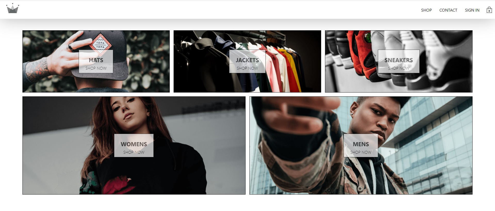

# To-Do List

#### Welcome to our E-Commerce with React and Redux project.

#### Features
- Have an authentication system.
- Have products to display.
- Add products to your card.
- Stripe integration (development mode).

#### Screenshot

#### Livedemo
- [heroku](https://e-commerce-ceci.herokuapp.com/)

## Getting started
- run `git clone https://github.com/Ceci007/crwn-clothing.git`.
- run `npm install`.
- run `npm start` to start node.
- cd to the client directory and run `npm start` again to start the React app.

## Author
👤 [Cecilia Benitez](https://github.com/Ceci007)

## Contributing

Contributions, issues and feature requests are welcome!

Feel free to check the [issues page](https://github.com/Ceci007/crwn-clothing/issues)

## Show your support

Give a star if you like this project!

## 📝 License

This project is MIT licensed.